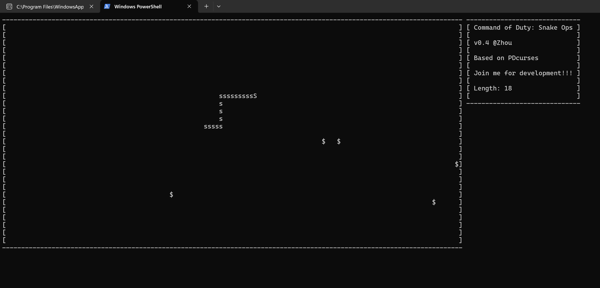

# C++ Snake Game Based on PDcurses, Zhouzhou

This is a Command line game built on PDcurses lib.

# Run/Compile

Command to compile(Windows only)

    g++ -o start start.cpp arena.cpp View.cpp data.cpp pdcurses.a

Run(Windows only)

    ./start

# Model

(almost) Uses MVC structure

Arena: Stores the objects and their functions

Start: Calls the functions in Arena to implement interactions between the obejcts

View: Draws the object onto the screen

data: Stores the related value

# Implementation Detai

Simple explanation of the code

## Snake

Snake is composed by a double-linked list of SnakeNode

    class SnakeNode{
    public:
      SnakeNode(int row, int col): row{row}, col{col} {}
      int row;
      int col;
    }

double-linked list can push_front and pop_back and that's why I used it instead of vector

    bool Snake::update(){
      if(orientation == 1){
          body.push_front(head().moveUp());
      }else if(orientation == 2){
          body.push_front(head().moveRight());
      }else if(orientation == 3){
          body.push_front(head().moveDown());
      }else if(orientation == 4){
          body.push_front(head().moveLeft());
      }
    }
    //Holy shit it is so tiring to write real code
    //I am gonna use psuedocode!!

When moving, push front the new Node and pop back the last Node.

If the snake need to be longer, just don't pop back the last Node for this time.

    if(Get_longer)
    {
      do not pop back;
    }else
    {
      pop back;
    }

The information of the snake should be stored in to the matrix of arena

    for(every SnakeNode in the list)
    {
      set their position to -1
    }
    set the postion of the last node to be initial value

Also you need to draw the snake

    for(every SnakeNode in the list)
    {
      draw draw draw!! hahaha
    }

## Arena

Arena has its width and height stored in data.cpp.

It also has a matrix, which is implemented by a 2D vector of int.

In the vector, 1 stands for the food and -1 stands for the SnakeNode.

Of couse 0 stands for empty unit.

## Start

I implemented most of the game logic in this file.

Some logic is implemented within arena.cpp though...

Might be a little bit confused but I think it should be fine.

# Further

- Some AI player

- Of course some more UI

- Multiple Game Mode

- Multiple Snake style (hard to do it on ASCII though)

- Complex Map

- Obstacle on map

- Different level of the game

- Special power of the snake

- Better animation

- Cross-Platform (Linux/Mac OS)

- Achievements System